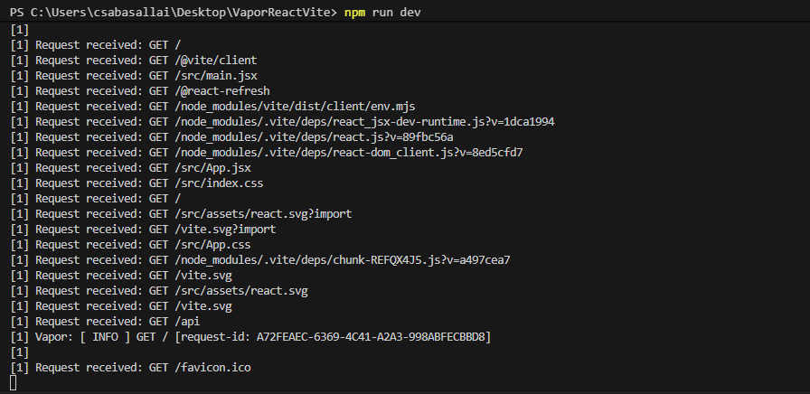
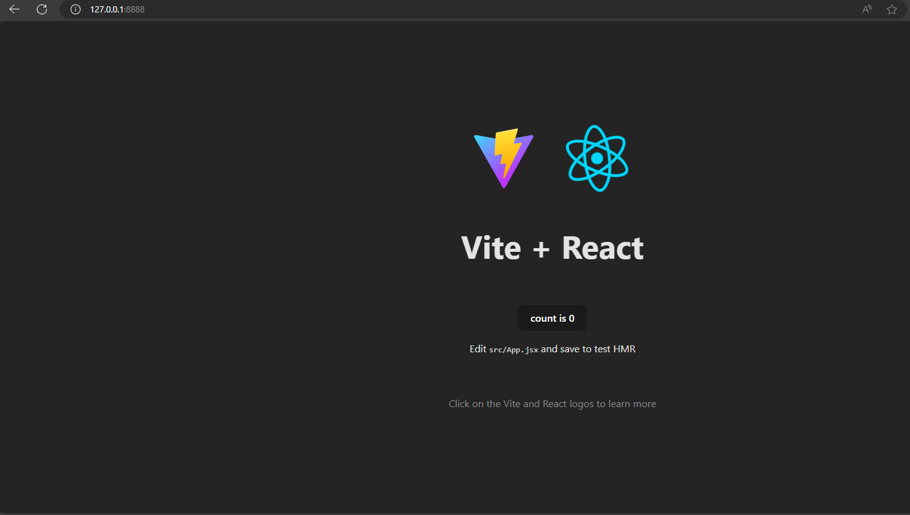

## VaporReactVite

<b>Vapor with React</b>
* Fully supported on Windows

## Screenshots



## Install on Windows (WSL required)
* Use the install script, it will install everything, WSL,Required packages,Swiftly, Swift, Vapor


```powershell (No need Admin privileges)
powershell -ExecutionPolicy ByPass -File .\install_part1.ps1 
```
Part2: Will help to install WSL (it requires Admin privileges)
```powershell
powershell -ExecutionPolicy ByPass -File  .\install_part2.ps1
```

Part2: Will help to install Swiftly, Swift + Vapor (it requires Admin privileges)
```powershell
powershell -ExecutionPolicy ByPass -File  .\install_part3.ps1
```
## To run the APP
Proxy server included, it will start both Vapor + React + Vite

* First install React + Vite using the following command:
```powershell
npm install
```
* Then run the following command: (it will start both Vapor + React)
```powershell
npm run dev
```

## Endpoints
```powershell
http://localhost:8888/ -> React + Vite
http://localhost:8888/api -> Vapor
```
