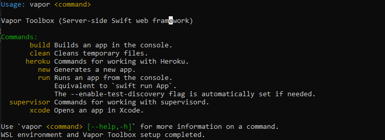

## VaporReactVite

Vapor + React (as frontend)


## Install on Windows (WSL required)
* Use the install script, it will install everything, WSL,Required packages,Swiftly, Swift, Vapor


(Adminstrator previliges required)
```powershell
powershell -ExecutionPolicy ByPass -File .\install.ps1
```

## To run the APP
```powershell
vapor run
```
